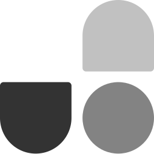
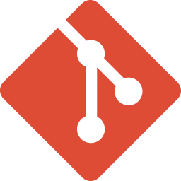

<link href="./style.css" rel="stylesheet"></link>

me, hakan... senior front-end developer...  
i develop and manage front-end architectures for web apps

## follow/contact me

## tech stack

  
  

  
  
  
  
  

  
  
  
  
  
  

  
  
  

## tools

  
  
  

